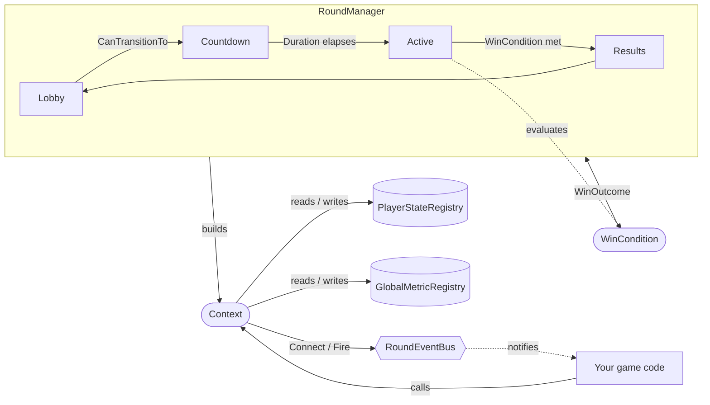

# Core Concepts

RoundKit is built around four core concepts. Understanding how they fit together makes the rest of the API straightforward.

## A round is a state machine, not a script

Most hand-rolled round systems end up as a pile of `if phase == "X"` checks spread across several scripts, with player state, timers, and win logic all tangled together. RoundKit separates those concerns into four pieces:

- **`RoundManager`** — owns the round. It holds the current phase, drives the update loop, and coordinates transitions.
- **`Phases`** — plain data describing each stage of the round (`Lobby`, `Countdown`, `Active`, `Results`, or whatever your game needs), including what they can transition to and what happens on enter/exit/update.
- **`Context`** — the interface your game code actually talks to. It wraps the manager and exposes the operations you need (reading player state, checking the current phase, transitioning, firing events) without exposing the manager's internals.
- **`WinCondition`** — a named, reusable rule that decides when a phase should end and who won.

Two supporting systems sit underneath these:

- **`PlayerStateRegistry` / `GlobalMetricRegistry`** — per-player and round-wide data, scoped to the round and cleaned up automatically when it resets.
- **`RoundEventBus`** — allows phases, win conditions, and game systems to communicate without direct dependencies.

## How they fit together

A few things worth noticing in this diagram:

- Your game code never talks to `RoundManager` directly, it goes through `Context`. This is intentional: `Context` is the stable surface your phases and win conditions depend on, so the manager's internals can change without breaking your game code.
- `WinCondition` doesn't transition phases itself, it returns a `WinOutcome`, and it's up to the phase's `OnEnter` handler (via `Context:Connect("OnWinConditionMet", ...)`) to decide what to do with it. This keeps "did someone win" separate from "what happens when they do."
- `PlayerStateRegistry` and `GlobalMetricRegistry` are round-scoped, not global, they exist for the lifetime of a round and clear out when it resets, so you don't have to manually track and wipe player data between matches.
- The event bus is the escape hatch: anything that doesn't fit neatly into a phase hook (UI updates, analytics, cross-system side effects) can hang off an event instead of being wedged into `OnEnter`/`OnUpdate`.

## Why it's structured this way

The split exists because these three questions tend to change independently of each other in a real game:

1. **What stages does a round go through?** (phases)
2. **When has someone won?** (win conditions)
3. **What happens to a player mid-round who disconnects?** (reconnection policies — covered later)

Because these pieces are independent, you can swap a `LastAlive` win condition for a `TimeLimit` one without changing your phases, or add new phases without rewriting win logic. The goal isn't to provide functionality you couldn't build yourself, it's to provide a structure that stays manageable as your game grows.

With that mental model in place, the next sections walk through each piece in detail, starting with the smallest possible working round.